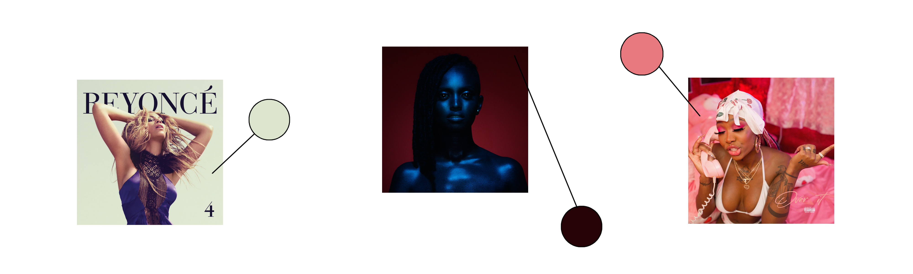

# Color Me Impressed: A Data-Driven Exploration of Color and Design Trends Among Top-Selling R&B Albums

**Project Summary:**  This project is an analysis of visual characteristics of album artwork of R&B albums throughout the decades. The goal is to discover patterns and trends that could be applied to the design of future album covers. The study uses Python tools such as pandas, matplotlib, ColorThief, Spotipy, Glob, and Excel to extract data from Spotify's API on R&B albums from the past 30 years, focusing on the color palettes used in the album artwork. 

The study also explores the potential emotional and psychological effects that the colors in the design might have on the viewer based on the time period, and how it may influence consumer perception and behavior.

**Tools Used:** Python (pandas, matplotlib, ColorThief, Spotipy, Glob), Excel

As an illustrator, I am all about the visuals. I've especially been drawn to album cover art and the way it can enhance the listening experience. This fascination led me to start building my own CD collection last year, as I wanted to have a tangible way to appreciate and collect music without relying on digital media (plus, it's just more fun to be able to flip through a physical collection and see all your favorite albums). 

In my search for new R&B albums, I found myself regularly visiting record stores in LA, browsing through the racks. It was during these trips that I couldn't help but be struck by the variety of colors and designs on the album covers and how they caught my eye. The more I looked, the more I appreciated the artistry and creativity that went into the design of these covers.

Just recently, I looked through my CD collection and began to notice patterns in the color palettes used on the album covers and how they reflected the overall aesthetic of the decade it was released in and the tone of the music. This sparked my curiosity and led me to conduct a study about the relationship between color trends for album artwork and musical trends in albums and how it may influence consumer perception and behavior. 

---

## How Design Paints a Picture of Success
Aside from the music itself, album artwork adds an extra layer of appeal for listeners. Whether it's a single, CD cover, digital album cover, vinyl sleeve, or other merchandise, the artwork serves as a unique and visually striking representation of the artist. Just like a well-designed logo can help a brand stand out in a crowded market, a visually striking album cover can do the same for an artist in the music industry. The artwork serves as a visual signature, instantly signaling to listeners which artist created the album.
 
In addition to this, it's also important to consider the potential emotional and psychological effects that the colors in your design might have on the viewer.

Color theory suggests that certain colors can evoke certain emotions and associations in the viewer. For example, red may be associated with passion and aggression, while blue may be associated with calmness and trustworthiness. The use of color in marketing and branding has long been a topic of interest in the field of psychology and design. 

Marketing experts often use color psychology to attract and influence customers, and this principle may also be applied to album cover art to create an impactful and memorable design (and ultimately, their decision to purchase an album).

_Photo courtesy of Bedtracks._

---

## Methodology

I was inspired by a GitHub project called "modeling_spotify_api_data" created by saracoop, in which they developed a Visual AI model that could accurately predict an album's genre or popularity based on data from the Spotify API. 

For my own study, I decided to focus on a specific genre, R&B, in order to narrow my focus to a specific type of consumer. I created 4 different playlists on Spotify for four different eras (90s, 2000s, 2010s, and 2020s) to extract information from the top 330 R&B albums from the 1990 to 2022 (top ten albums per year - the list was devised by aggregating more than 50 best-of lists focused on R&B and soul albums - these figures were averaged with the albums’ overall status).

I used the 'Spotipy' library to extract the necessary information (artist, album photo, etc.) and the 'ColorThief' library to extract the dominant color from each album cover. I cleaned the data using Excel, then used the 'pandas' library to analyze and visualize the data, looking for trends and patterns in the distribution of dominant colors. I also used 'matplotlib' to create charts and graphs to help illustrate my findings.

### Limitations

**Album cover designs:** The album cover design is influenced by a lot of factors, color palettes are just one of them, other factors such as images, typography and overall layout also play a significant role in the final design, it's important to consider them in order to have a more complete understanding.

---

## Data

The data presented in the following sections provides an overview of my research findings. To effectively convey the information, I utilized both histograms and scatter plots as my main means of data visualization.

<ins>RGB Histograms:</ins>
 An RGB histogram is a graphical representation of the distribution of colors in an image. It is made up of three separate histograms, one for each of the primary colors (red, green, and blue). The x-axis represents the color values (from 0-255), and the y-axis represents the frequency or count of pixels with that color value.

In an RGB histogram, the peaks (or the bars) would indicate the dominant colors in a group of images. The heights of the peaks represent the frequency. So, the taller the peak, the more frequent that color is in each dataset.

A high frequency of a color means that there are a lot of pixels in the image with that color value. For example, if the red histogram has a high peak at a value of 200, it means that there are a lot of pixels in the image that are a bright red. This could indicate that the image has a lot of red elements in it, or that the overall color balance is skewed towards red.

On the other hand, a low frequency of a color means that there are few pixels in the image with that color value. For example, if the green histogram has a low peak at a value of 50, it means that there are few pixels in the image that are a mid-tone green. This could indicate that the image has little green elements in it, or that the overall color balance is skewed away from green.

_This histogram implies that the album covers from the 90s primarily feature high amounts of red, sepia-toned browns, and yellows as their dominant colors. Additionally, it also suggests that there is a substantial presence of light blue and teal tones among the dominant colors._

_This histogram implies that the album covers from the 2000s primarily feature high amounts of mid tone greens, browns, and blues as their dominant colors. Additionally, it also suggests that there is a substantial presence of light pinks and magenta tones among the dominant colors._

_This histogram implies that the album covers from the 2010s primarily feature high amounts of mid tone greens, browns, and blues as their dominant colors. Additionally, it also suggests that there is a substantial presence of light blues and magenta tones among the dominant colors._

<ins>Color Maps:</ins>
 Color maps are visual representations of the color distribution in an image. They are typically created by mapping the color values of an image to a fixed set of colors, and then displaying the results in a grid or a heat map format. 

Color maps can be useful for analyzing trends in album cover color palettes because they can provide a quick and intuitive way to identify patterns in the color distribution. For example, if a color map shows a cluster of similar colors in one area, it could indicate that a certain color scheme is being used consistently across many album covers.

* colors clustered towards the left
* mostly cool colors

* colors slightly clustered towards the left and top right
* mostly warm colors

* colors clustered towards left and middle right
* many pastels and dark, cool colors

### Further Analysis

The typical sound of R&B in the 90s was characterized by a smooth, soulful sound with a strong emphasis on vocals and live instrumentation. In the 2000s, R&B incorporated more elements of hip-hop and electronic music, resulting in a more upbeat and energetic sound. In the 2010s, R&B continued to evolve with the incorporation of more unique elements and experimentation with different sounds and styles. 

Overall, the energy, valence, and tempo of R&B have varied over time, with different sub-genres and artist trends contributing to these changes. 

Differences in color palettes among R&B album covers from different decades:

<ins>90s:</ins> R&B albums covers from the 90s might have a more muted or subdued color palette, with a focus on earth tones, such as brown, beige, and navy blue, which were popular colors during that decade. They may also use cool, metallic tones of green and blue to reflect the emergence of Y2K in the mid nineties (reaching its peak in 1999) or rich colors that conveyed a sense of depth and emotion. 

Earth tones became popular in the 90s as a reaction to the excess of the 80s (ex. New Jack Swing movement), as people were looking for a more natural and organic aesthetic. People gravitated towards earth tones because they represented a sense of calm and simplicity in a time of rapid change and uncertainty.

<ins>2000s:</ins> R&B album covers from the 2000s may have a more polished and glossy look, using a lot of metallic colors like silver and gold and brighter colors like reds and blues. Also, they may incorporate patterns and textures in the cover designs, this could be a reflection of the influence of Hip-Hop culture and electronic music, which was at its peak during the late 2000s. 

The metallic look became popular as a reflection of the optimism and excitement of the new millennium. The technological advancements and the popularization of the internet and social media, have led to a more connected and globalized world, which was reflected in the use of clean, bright colors.

<ins>2010s:</ins> R&B album covers from the 2010s may incorporate more minimalistic and modern designs, with a focus on bold typography and simple graphics as the genre became more experimental. They may also use more neutral colors like black, white, and gray, as well as pastel colors and gradient colors which were popular during that decade. 

The influence of digital technology and the rise of digital media ultimately contributed to the popularity of these styles. With the increased use of digital devices and the internet, people were exposed to a vast array of design styles and visual aesthetics that would allow them to push boundaries.

---

## How can artists stand out from the crowd this decade?

In the context of album covers, standing out might mean using colors that are unusual or unexpected, or using colors in a way that is particularly eye-catching. There are pros and cons to both following trends and choosing the opposite. Following trends can help an album cover fit in with what is popular at the time and appeal to a wide audience. However, it can also make the cover feel less unique and potentially less memorable.

With R&B music crossing over different sub-genres, it could be beneficial to look into other music genres and art forms, such as contemporary art, fashion, and architecture, to find inspiration.

<ins>2020s:</ins> R&B album covers from the 2020s may continue to be more diverse, reflecting the different sounds and styles of the music. R&B has incorporated many subgenres like neo-soul, R&B trap and Afrobeats, each with its own aesthetic. That being said, it could be possible to still see a trend of using a lot of bright colors, bold typography but also a lot of gradient colors, duotones and vintage, washed out colors.

_This histogram implies that the album covers from the 2020s primarily feature high amounts of mid tone greens and reds as their dominant colors. Additionally, it also suggests that there is a substantial presence of both saturated and light blues and soft brown tones among the dominant colors._

* variety of colors 
* many pastels and desaturated, cool colors

Artists can leverage the latest technology offered by streaming services, such as Spotify Canva, to enhance their creative output. This service allows music to be paired with dynamic visuals, rather than traditional static artwork. While creating these visuals may be challenging, it presents a chance for artists to expand their artistic expression and engage their audience in new ways through the use of moving images.

Also, it's important to note that standing out doesn't always mean being different for the sake of it, but it's about being relevant, authentic, and true to oneself and the music.

In the end, it's all about understanding the target audience and what they want, and then finding a balance between standing out and fitting in. A well-designed cover can create a positive first impression and make the album more appealing to consumers. 

---

*For future studies, I hope to analyze the lyrics of songs and visualize the evolution of the themes and emotions over time, and then compare that to the corresponding album covers.*

---

**<a href="https://github.com/saracoop/modeling_spotify_api_data/blob/master/data_collection">saracoop's GitHub</a>**

**<a href="https://github.com/ememercy21/ememercy21.github.io/blob/main/images/spotify/Spotify Albums RNB project.ipynb">My Jupyter Notebook Extras</a>

**References**

[1] Agbai, B. (n.d.). The evolution of R&B: from the 90s to now. Theboar.org. Retrieved January 12, 2023, from https://theboar.org/2020/11/the-evolution-of-rb/

[2] Alexander, L. (2016, May 19). The Y2K aesthetic: who knew the look of the year 2000 would endure? The Guardian. https://www.theguardian.com/technology/2016/may/19/year-2000-y2k-millennium-design-aesthetic

[3] Babcock, G. (2022, July 29). The 25 best fashion trends of the early 2000s. Complex. https://www.complex.com/style/best-fashion-trends-of-early-2000s/rapper-clothing-brands

[4] Cliffen, J. (2015, November 11). Bedtracks — the relationship between music & colour. Bedtracks. https://www.bedtracks.com/blog/2015/11/10/the-relationship-between-music-colour-5-reasons-why-its-important

[5] Conceptdrop. (2018, March 13). Color theory: Marketing, branding, and the psychology of color. ConceptDrop. https://conceptdrop.com/blog/60-color-theory-the-psychology-of-color-marketing-and-branding/

[6] Rubio, A. (2020, April 28). 2010-2019: The evolution of design trends in the last decade. Freepik. https://www.freepik.com/blog/2010-2019-the-evolution-of-design-trends/
