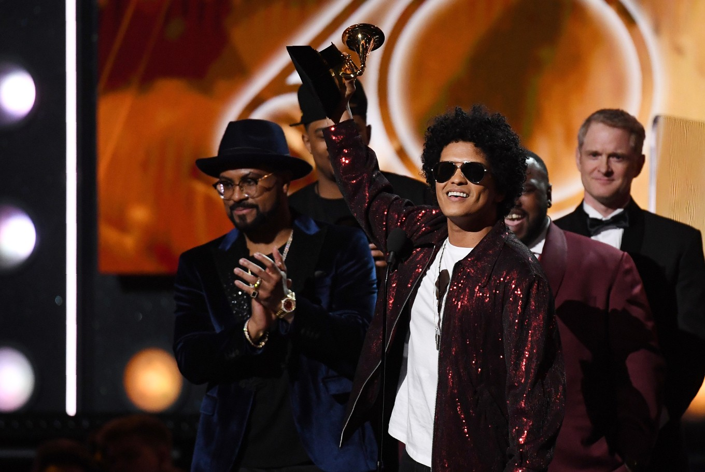
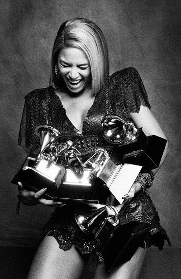
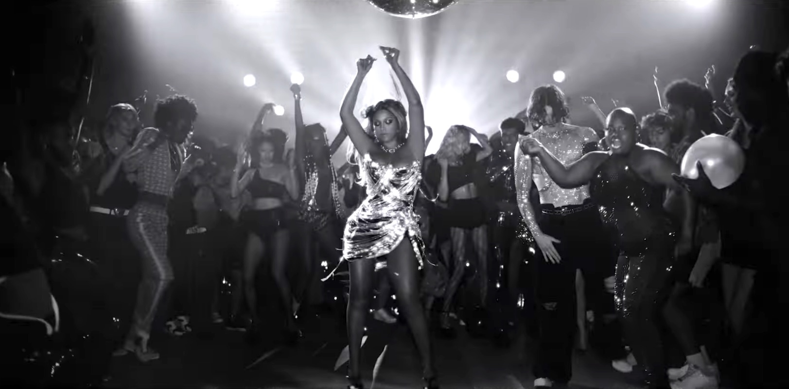

# Lemons to Lemonade: A Sour Taste for Black Artists at Music's Most Prestigious Award Show

**Project description:** The purpose of this comparison is to examine the recognition and valuation of a Black artist's work at different award institutions and to identify any discrepancies. This study aims to understande the music industry's view of Black artists and to consider the need for change in these systems.

**Tools Used:** Excel, Tableau

It's that time of year again, music fans! Time to get out the popcorn, crack open a cold one, and huddle around the TV like it's the NBA draft - but instead of ballers, we're picking apart the nominations at the 2023 Grammy Awards. That's right, it's Grammy season and there's been a lot of buzz about the nominations this year. As a self-proclaimed music nerd, I couldn't resist the urge to dive into the controversy surrounding the prestigious award show and see what's really going on beneath all that glitz and glamor.

And who better to focus on than the one and only Beyoncé - a highly visible and critically acclaimed artist who, despite having a diverse and groundbreaking discography, is often pigeonholed into the "urban" categories at the award ceremony. By using Beyoncé as the focus of the project, I was able to compare how various institutions view and categorize her work differently.

---

## The Grammys Have a Problem: A Look at the History of Snubbing Black Artists
Nomination and award snubs have been a longstanding issue at the Grammy Awards, with some artists and music industry insiders speaking out about the lack of diversity and inclusion at the awards show. For example, in 2021, The Weeknd, a Black artist, was shut out of major categories despite having a successful year with his pop album After Hours and its hit single "Blinding Lights." The Weeknd called out the Grammy Awards on social media, saying that "the Grammys remain corrupt" and that he would not be submitting his music for consideration in the future. This incident sparked a wider conversation about the lack of diversity and inclusion at the Grammy Awards and the need for change within the music industry.

Black artists who do receive a nomination often face disproportionate recognition compared to White artists in certain categories. Black artists are frequently pigeonholed into specific categories, such as "urban" or "R&B," even if their music fits into a different genre. It can perpetuate the stereotype that Black artists are only capable of creating certain types of music, which is not only inaccurate but also harmful and dismissive of the diversity and creativity of Black artists.

White artists, on the other hand, are more likely to be nominated in a wider range of categories, including R&B and hip-hop. Non-Black artists who make hip-hop and R&B music may be perceived as more palatable to mainstream audiences, and as a result, they may receive more recognition and award wins (e.g. Macklemore).

_Photo courtesy of NBC News._

For instance, Bruno Mars, a non-Black artist, won seven Grammy Awards for his album 24K Magic, including Album of the Year, Record of the Year, and Song of the Year, in 2018. Mars' music, which blends elements of funk, soul, and pop, was widely praised for its catchy hooks and upbeat sound, but some critics argued that it did not break new ground in the way that some other Black artists were doing at the time.

---

## Grammy's Golden Girl Gets the Bronze Treatment
This project builds upon an Op-Ed published in the Los Angeles Times titled "Beyoncé's Grammy snub and the glass ceiling on black art," in which John Vilanova discusses how, despite being the most Grammy-nominated woman ever, Beyoncé's win rate is significantly lower than that of other artists.

The data below, which covers the period up to 2020, for this comparison was drawn from nominations and wins from various award shows. Her most recent nominations have been excluded as the results are still pending at the time of this review. To narrow our focus, we will concentrate on the top five multicultural award shows based on popularity and cultural significance.

The award type "Race" encompasses award categories that fall under the genres of R&B and hip hop (such as, but not limited to Best R&B Album, Best Rap Album, and Best Rap Performance, among others), which are both predominantly created by Black artists. It's important to highlight that some Black artists are often boxed into these categories, even if they don't primarily make this type of music.

**Total Number of entries at each award show:**

_She has received more Grammys than any other award._

**How many times has Beyoncé been nominated for each award show, and how many times has she won at each show (non-specific categories)?:**

**How many times has Beyoncé been nominated for each award show, and how many times has she won at each show based on race?:**

_*The award types, Gender & Race and Video & Race are included in Race_

**A breakdown of her nominations and wins (all award shows):**

**A breakdown of her nominations and wins (at the Grammys):**

**How do the number of nominations and wins at the Grammy Awards compare for Beyoncé compared to other artists such as Adele?:**

_Both Beyoncé and Adele are highly successful and critically acclaimed artists, and they have both received numerous nominations and wins at various award shows. Adele has won a total of 15 Grammy Awards, approximately an 83.3% win rate. Beyoncé, on the other hand, has won a total of 24 Grammy Awards, approximately a 34.2% win rate._

**How have Beyoncé's nominations and wins at the Grammy Awards and other award shows changed over time?:**

Based on the trendlines, Beyoncé's nominations have increased over time while her wins have decreased.

_But why?_

There could be many factors that could contribute to this trend, such as the emergence of new and competing artists, shifts in public taste or industry trends, or, as I will discuss in the following section, the subject matter and lyrical content of her most recent works (most notably, Lemonade and The Lion King: The Gift).

**Have there been any notable differences in the way that Beyoncé has been recognized at the Grammy Awards vs the other award ceremonies, such as in the types of music or projects that she has been recognized for? How might this impact the differences in nominations and wins for Beyoncé at these award shows?**

Beyoncé is a polarizing artist in part because she addresses themes of race, politics, and social justice in her music and public statements. This has made her a prominent figure in debates and discussions surrounding these issues, and her work has sometimes been seen as controversial or divisive by different groups of people.

For instance, some of Beyoncé's music and performances have been seen as celebrating and advocating for Black culture and empowerment, while others have been perceived as controversial or offensive for their depiction of race and gender. Additionally, Beyoncé has been vocal about her support for social justice causes and has used her platform to speak out on issues such as feminism and intersectionality, police brutality, and racial inequality. This has led to both positive and negative responses from different groups of people, contributing to the perception of Beyoncé as a polarizing artist.

Lemonade received recognition at both the Grammy Awards and BET Awards, but was more successful at the latter in terms of winning awards. The album's visual project and her Super Bowl 50 halftime show in 2016 included references to the Black Lives Matter movement and the aftermath of Hurricane Katrina, and were widely praised by some as powerful statements on racial and social justice issues. However, both also sparked controversy and backlash, with some critics arguing that her performance was inappropriate for a mainstream sporting event.

At the Grammys, Lemonade and songs from the album received several nominations, including for Song of the Year and Best Music Video. However, the project received just two awards for the entire album era. Most notably, Beyoncé lost the Album of the Year award in 2017, which sparked online discourse and controversy. At the BET Awards, on the other hand, she was nominated for 13 awards and received a total of 11, including Album of the Year and Video Director of the Year.

---

### How I Am… Sasha Fierce Exposes the Narrow Criteria for Music Evaluation

_Beyoncé's third solo album, 'I Am… Sasha Fierce,' was released in 2008, featuring a seamless blend of R&B, pop, and hip hop. The album soared to the top of the charts, selling over 4 million copies in the US and earning critical acclaim. It racked up a whopping nine Grammy nods, snagging six awards including Best Female R&B Vocal Performance and Song of the Year. Photo courtesy of Beyonce.com_

As previously mentioned, Black artists are often recognized in the major categories of award shows, such as the Grammy Awards, for music that conforms to mainstream expectations rather than challenging the status quo and advocating for change. Musicians and other celebrities who are racialized, or perceived as being part of a particular racial group, often have to navigate the intersection between their own personal racial identities and the strategies they use to manage their public image and brand.

In order to appeal to a wide audience, these celebrities may feel pressure to balance their authenticity and self-expression with the branding needs of mainstream, predominantly white consumers. As a result, their strategies for managing their racial identity can become intertwined with the management of their celebrity brands. This can be challenging, as these celebrities must carefully consider how their actions and self-presentation might be perceived by different audiences and avoid offending the racial identities of those consumers.

The Grammy Awards recognition of Beyoncé's album I Am… Sasha Fierce highlights an important issue in the music industry. While the album was commercially successful and well-received by various audiences, some critics argue that it was considered "safe" due to its mass pop appeal, rather than pushing the boundaries and challenging the status quo. This raises questions about the way that Black artists are often expected to conform to mainstream expectations in order to achieve mainstream success.

It is worth noting that I Am… Sasha Fierce remains Beyoncé's most commercially successful album to date and has garnered her the most Grammy wins and nominations of any of her releases. Among these awards is her only major category win, Song of the Year, for the single, "Single Ladies". I do want to preface this by saying that this criticism should not be interpreted as implying that Beyoncé was "selling out" or compromising her artistic integrity in any way. 

Instead, I would argue that the focus on the album's commercial success and its appeal to a broad audience reflects a "colorblind" approach to evaluating music, which fails to fully acknowledge and celebrate the unique cultural and artistic contributions of Black artists. I Am… Sasha Fierce was and still is a very successful and well-received album that contributed to Beyoncé's reputation as a talented and influential artist.

**How do the criteria for nomination and selection at the Grammy Awards and a minority-focused award show such as the BET Awards differ?:**

The criteria for nomination and selection at the Grammy Awards and BET Awards may differ in a number of ways, which could impact the differences in nominations and wins for Beyoncé at these two award shows. The Grammy Awards are presented by the Recording Academy, which is a professional organization that represents the recording industry. The awards recognize excellence in the recording arts and sciences and are presented to artists, producers, and engineers for their work in music. As stated previously, they are considered one of the most prestigious music awards shows in the world.

The BET Awards, on the other hand, are presented by the Black Entertainment Television network and recognize excellence in the entertainment industry among African American artists. The awards are presented in a variety of categories, including music, television, film, and sports. There may be differences in the criteria for nomination and selection at these two award shows in terms of the specific categories that are recognized, the eligibility requirements for nominees, and the process for selecting winners. For example, the Grammy Awards have a large number of categories that cover a wide range of musical genres, while the BET Awards may focus more specifically on genres that are popular among Black audiences.

Additionally, the voting committees or panels for the two award shows may differ in terms of their demographics and the criteria they use to evaluate nominees and select winners. The Recording Academy is made up of professionals in the music industry, including artists, producers, engineers, and other music professionals. The voting panel for the Grammy Awards is made up of Recording Academy members who are active in the music industry, and the panel is selected to represent a diverse range of musical genres and backgrounds. The demographics of the voting panel for the Grammy Awards may vary from year to year, but overall it is likely to be made up of a diverse group of music industry professionals.

While it is important for the Recording Academy to have a multifaceted array of voters, especially those involved in the music industry, to avoid bias, it is just as important to have voters with a deeper understanding of Black music and culture sitting in seats at these esteemed ceremonies.

---

## Are The Grammys Ready for Beyoncé's 'Renaissance', or Are They Still Stuck in the Dark Ages?

_'Renaissance', an album about escapism and self expression, celebrates the long legacy of Black musicians, figures, and creatives. It contains elements of Afrobeats, house, dance, funk/disco, and pop, genres that she has delved into on past albums. Photo courtesy of That Grape Juice._

As a Black woman who has lived and studied the history, culture, and politics of the peoples of the African diaspora and Africa, this project felt personal. Beyoncé was the gateway through which I could begin to consider what institutional barriers impede upon Black women's success. To understand Beyoncé's work, it is necessary to take into account every dimension of her audiovisual output as well as the broader reception of this product. If we omit the racial and racist history behind the representation of Black art next to the everyday forms of exclusion and racism that they are forced to confront, it is impossible to recognize the full significance of Beyoncé's and countless others discursive and performative politics.

It is time for a Renaissance in the Grammy Awards, with a renewed focus on diversity and inclusion and a commitment to recognizing and celebrating the diverse talents of artists from all backgrounds. This can be achieved through a number of steps, including expanding the pool of judges and nominees to be more representative of the music industry as a whole, and revisiting the categories and criteria used to evaluate music. It is also important for the Grammy Awards to listen to and respect the wishes of artists when it comes to categorization, as we saw with Beyoncé's fight to keep "Break My Soul" from her 2022 album Renaissance in the Dance/Electronic category instead of being placed in the R&B category.

As we look to the 2023 Grammy Awards, we can hope that the changes being implemented will lead to a more fair and inclusive award show, one that truly reflects the richness and diversity of the music industry. With a total of nine nominations, including another bid for Album of the Year, we can also hope that Beyoncé will be recognized for her exceptional talent and contributions to the music industry in the major categories. Only then can the Grammys truly be considered a prestigious and fair award show, worthy of the talents of artists like Beyoncé and all those who contribute to the rich tapestry of music.

---

**<a href="https://public.tableau.com/app/profile/mercy.eme/viz/LemonstoLemonadeASourTasteforBlackArtistsatMusicsMostPrestigiousAwardShow/Dashboard1">Tableau Dashboard</a>**

**References**

[1] Aswad, J. (2021, May 3). The Weeknd calls grammys 'corrupt,' despite inspiring their recent rule change: 'I will not be submitting music in the future' (EXCLUSIVE). Variety Daily. https://variety.com/2021/music/news/the-weeknd-grammys-corrupt-rule-change-1234964939/

[2] Baade, C., & McGee, K. A. (Eds.). (2021). Beyonce in the world: Making meaning with Queen Bey in troubled times. Wesleyan University Press.

[3] Colton, L. (2020). "Singing All the Time": Constructions of cultural identity in Beyoncé's I Am…Sasha Fierce. In Beyoncé: At Work, On Screen, and Online. Indiana University Press.

[4] Fontes, R. (2020). Grammy Awards [Data set]. https://www.kaggle.com/datasets/unanimad/grammy-awards

[5] Rambsy, K. (2020). Storytelling with Data - the Beyonce Edition [Data set]. Texas Data Repository Dataverse. https://dataverse.tdl.org/dataset.xhtml?persistentId=doi:10.18738/T8/XL8NIX

[6] Vilanova, J. (2017, February 13). Op-Ed: Beyoncé's Grammy snub and the glass ceiling on black art. The Los Angeles Times. https://www.latimes.com/opinion/op-ed/la-oe-vilanova-grammys-beyonce-adele-glass-ceiling-20170118-story.html
